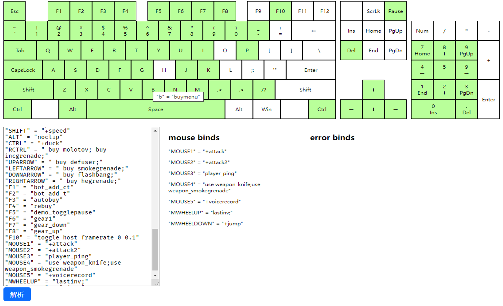

# Bind Visualization
[English](./README.md)

CS:GO 键位绑定可视化
## 使用
1. 在release页面下载，解压，打开，`index.html`
2. 打开 CS:GO，打开控制台并输入 `clear; key_listboundkeys`，把所有输出复制下来，粘贴到网页中的输入框中，点击解析按钮。所有被绑定的键会有浅绿色背景。鼠标悬停在被绑定的键位上会显示具体的绑定信息。注意，输出的绑定信息并不区分alias或CS:GO提供的指令。

合法的键有一个 `data-selector` 的HTML属性，这个属性的值可以在控制台用于绑定键位。比如，右边的shift键在控制台的代码是 `rshift`，可以用这个代码来绑定指令比如 `bind rshift +attack`。不合法的键如左win键和 PrtSc键 在外观上显示为空白

## 贡献代码
该项目下的样式文件是用less写的并编译为css，如需对样式做修改，需要在电脑上安装Node.js环境然后在项目文件夹中运行 `npm i`，然后在修改样式后运行 `npm build` 来把less代码编译成css样式